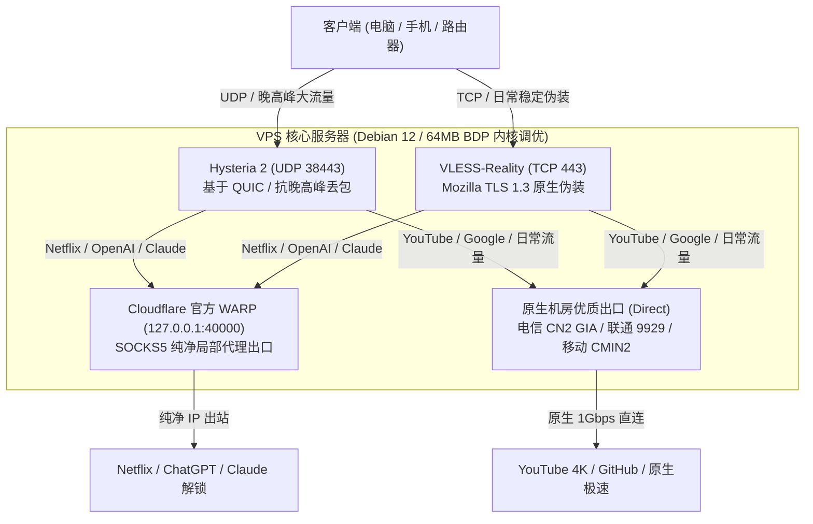

# 🌐 VPS Proxy Optimizer (VPS 科学上网搭建 · 深度优化 · 智能分流)

[](LICENSE)
[](#)
[](#)
[](#)
[](https://www.dmit.io/aff.php?aff=27958)

专为 **全新空白 VPS 从零全自动搭建** 以及 **已有 VPS 节点深度体检与调优** 设计的工业级网络架构方案与 AI Agent 技能（Skill）。

遵循实战经验，彻底解决长距离跨洋网络卡顿、IPv6 悬空超时、流媒体/AI 封锁等痛点，完美兼顾 **“Netflix 与 ChatGPT/Claude 纯净解锁”** 与 **“YouTube 4K 与日常网页原生极速秒开”**。

---

## 💡 为什么必须自建 VPS？（拒绝机场与商业 VPN）

在如今的跨境网络与 AI 时代，商业 VPN 和公共“机场”的体验正在雪崩式恶化：

1. **🚫 公共 IP 脏乱差，AI 封号重灾区**：
   * 机场一个节点往往数千人共用，充斥着黑产、爬虫与垃圾请求，早已被各大安全数据库列入黑名单。
   * 访问 **ChatGPT、Claude、Cursor、Perplexity 或 OpenAI API** 时，频繁弹人机验证、报错 `Access Denied`，甚至**直接毫无预警地永久封禁辛苦充值的 Plus/Pro 订阅账号**！
2. **🛡️ GFW 管控日益严苛，频繁断连与跑路**：
   * 防火长城（GFW）针对常见中转协议的主动探测越来越精准，公共机场动辄“大面积阵亡”。用户每天都在测速、找可用节点、更新订阅，心力交瘁，还要承受随时被跑路的财务风险。
3. **🔒 隐私裸奔与链路劫持**：
   * 商业 VPN/机场主拥有最高权限，你的访问行为、未加密流量与 DNS 查询理论上完全处于被监控与劫持风险之中。

> **自建 VPS 的不可替代性**：**独享纯净原生 IP + 独占千兆带宽 + 掌控最高权限**！再配合本项目独创的 **“原生直连高速出口 + Cloudflare WARP 局部纯净流媒体/AI 智能出站”**，彻底终结封号与断连焦虑。

---

## 🏆 强烈推荐服务器选型：DMIT (美西三网顶级优化线路)

自建代理体验的下限由协议决定，而**体验的天花板 100% 取决于 VPS 的回程网络线路**。

普通廉价 VPS（如 163 骨干网）在平时尚可，但一到**每天晚上 8:00 - 11:00 晚高峰黄金时段**，国际出口拥堵会引发 10%~30% 恶性丢包，瞬间降速卡死。

经过大量真实网络压测与多运营商横向对比，**最推荐选择美西洛杉矶高端优化线路的扛把子 —— [DMIT.io](https://www.dmit.io/aff.php?aff=27958)（PVM.LAX.Pro 系列）**。

👉 **[点击直达 DMIT 官方选购入口 (享受顶级优质网络)](https://www.dmit.io/aff.php?aff=27958)**

### 🔥 为什么首选 DMIT？（真实亲测体验）
* **👑 三网顶级优化回程（CN2 GIA / 9929 / CMIN2）**：
  * 电信双向走 **CN2 GIA (AS4809)** 高端商务专网；
  * 联通走 VIP 专线 **AS9929 / AS10099 (CUG/CUII)**；
  * 移动走新一代精品网 **CMIN2 (AS58807)**。
  * 无论家里或手机用什么宽带，国内三网全部直达，**晚高峰全天 0 丢包**！
* **⚡ 4K 视频丝滑秒开**：
  * 物理延迟低至 **135ms ~ 145ms**（媲美沿海直达）。配合本项目全套实施的 **64MB BDP 缓冲区与双向 TFO 调优**，单线程突发带宽拉满，YouTube 4K/8K 视频进度条任意拖拽零缓冲。
* **📞 实时海外会议与音视频通话零卡顿**：
  * Zoom / Google Meet / Discord / Telegram 高清语音与视频通话延迟极低、无抖动、无机械音，彻底告别断续。
* **🛒 下单选型建议**：
  * **机型系列**：推荐 `PVM.LAX.Pro.TINY` 或 `SHARE` 系列；
  * **系统镜像 (VM Template)**：**务必勾选 Debian 12**（生态兼容最佳，完美契合本技能一键部署）；
  * **流量模式**：选择 `1000GB @ 1Gbps` 高速峰值带宽（勿选 4Mbps 限速陷阱）。

---

## 🏗️ 核心网络架构



---

## ✨ 核心特性

1. **双主力抗封锁架构**：
   * **Hysteria 2 (UDP 38443)**：基于 QUIC 协议与 Salamander 混淆，专为晚高峰易丢包的廉价公网 VPS 设计，跑满物理带宽。
   * **VLESS-Reality (TCP 443)**：借用 `addons.mozilla.org` 原生 TLS 1.3 证书伪装，零域名维护成本，彻底规避 GFW 针对苹果 CDN 的深度探测告警。
2. **WARP 局部纯净分流（双出口设计）**：
   * 采用 Cloudflare 官方客户端运行在本地 `127.0.0.1:40000` SOCKS5 代理模式。
   * 仅针对流媒体与 AI 服务出站分流，**绝不修改系统全局默认路由**，确保日常及 YouTube 100% 走原生机房极速直连。
3. **长肥网络 (LFN) 工业级内核调优**：
   * 中美 140ms 延迟下，系统默认的 208KB 缓冲区会导致单线程速率无法展开。
   * 全套实施 **64MB TCP/UDP BDP 缓冲区扩容**、**BBR + FQ** 拥塞控制、**双向 TCP Fast Open (TFO)**、**关闭连接空闲慢启动**，视频暂停重播无需慢启动热身。
4. **防翻车客户端交付规范**：
   * 必须配齐 `Fake-IP` + 境外防污染 `Fallback DNS` 架构；
   * 严格包含 `MATCH` 兜底规则与国内直连白名单，杜绝在开启 TUN 虚拟网卡时因规则缺失导致的“全盘断网”假死故障。

---

## 🚀 快速使用

### 方式 1：作为 AI Agent 技能安装（推荐）

本仓库遵循 [Antigravity Skill 标准规范](https://github.com/)。将本仓库作为 Skill 放置在你的 Agent 技能目录中：

```bash
# 复制或软链接至 Agent 技能目录
mkdir -p ~/.gemini/config/skills/vps-proxy-optimizer
cp SKILL.md ~/.gemini/config/skills/vps-proxy-optimizer/
```

当向 AI 助手发送：*“我有一台新买的 VPS，帮我全自动配置自建节点”* 时，Agent 会自动阅读 [`SKILL.md`](SKILL.md) 并全自动完成安全部署。

---

### 方式 2：手动一键部署流水线

如果你喜欢直接在服务器终端执行，可按以下步骤操作：

#### 1. 系统底层与内核调优 (Debian 12)
```bash
# 更新基础工具
export DEBIAN_FRONTEND=noninteractive
apt-get update -qq && apt-get install -y curl wget git jq ufw openssl lsb-release gnupg socat

# 写入 64MB BDP 与 TCP 调优配置
cat << 'EOF' > /etc/sysctl.d/99-vps-optimizer.conf
net.core.default_qdisc = fq
net.ipv4.tcp_congestion_control = bbr
net.core.rmem_max = 67108864
net.core.wmem_max = 67108864
net.core.rmem_default = 1048576
net.core.wmem_default = 1048576
net.ipv4.tcp_rmem = 4096 87380 67108864
net.ipv4.tcp_wmem = 4096 65536 67108864
net.core.somaxconn = 8192
net.ipv4.tcp_max_syn_backlog = 8192
net.core.netdev_max_backlog = 10000
net.ipv4.tcp_tw_reuse = 1
net.ipv4.tcp_fin_timeout = 15
net.ipv4.tcp_keepalive_time = 300
net.ipv4.tcp_keepalive_intvl = 15
net.ipv4.tcp_keepalive_probes = 5
net.ipv4.tcp_fastopen = 3
net.ipv4.tcp_mtu_probing = 1
net.ipv4.tcp_slow_start_after_idle = 0
fs.file-max = 1000000
EOF
sysctl -p /etc/sysctl.d/99-vps-optimizer.conf

# 防火墙放行
ufw allow 22/tcp || true
ufw allow 443/tcp || true
ufw allow 38443/udp || true
```

#### 2. 安装 Cloudflare 官方 WARP
```bash
curl -fsSL https://pkg.cloudflareclient.com/pubkey.gpg | gpg --yes --dearmor --output /usr/share/keyrings/cloudflare-warp-archive-keyring.gpg
echo "deb [signed-by=/usr/share/keyrings/cloudflare-warp-archive-keyring.gpg] https://pkg.cloudflareclient.com/ bookworm main" | tee /etc/apt/sources.list.d/cloudflare-client.list
apt-get update -qq && apt-get install -y cloudflare-warp

warp-cli --accept-tos registration new 2>/dev/null || warp-cli --accept-tos register 2>/dev/null || true
warp-cli --accept-tos mode proxy
warp-cli --accept-tos proxy port 40000
warp-cli --accept-tos connect
```

#### 3. 部署 Hysteria 2
```bash
bash <(curl -fsSL https://get.hy2.sh/)

mkdir -p /etc/hysteria
openssl req -x509 -nodes -newkey ec:<(openssl ecparam -name prime256v1) -keyout /etc/hysteria/server.key -out /etc/hysteria/server.crt -subj "/CN=bing.com" -days 36500

# 详见 SKILL.md 步骤 3 写入带 WARP SOCKS5 分流的 /etc/hysteria/config.yaml
systemctl enable --now hysteria-server
```

#### 4. 部署 Xray VLESS-Reality
```bash
bash -c "$(curl -L https://github.com/XTLS/Xray-install/raw/main/install-release.sh)" @ install

# 生成密钥并配置 /usr/local/etc/xray/config.json
# 伪装目标采用 addons.mozilla.org:443
systemctl enable --now xray
```

---

## 📋 客户端导入与配置规范

### 1. 节点直连 URL 结构
* **Hysteria 2**：
  `hysteria2://${PASSWORD}@${SERVER_IP}:38443/?sni=bing.com&insecure=1&obfs=salamander&obfs-password=${OBFS_PASSWORD}#VPS-Hy2`
* **VLESS-Reality**：
  `vless://${UUID}@${SERVER_IP}:443?security=reality&encryption=none&pbk=${PUBKEY}&headerType=none&fp=chrome&type=tcp&flow=xtls-rprx-vision&sni=addons.mozilla.org&sid=${SHORTID}#VPS-Reality`

### 2. 扫码便捷导入
推荐在本地使用 Python `qrcode` 生成节点二维码直接通过手机相机或客户端（Shadowrocket、Sing-box、v2rayNG）扫码导入。

---

## 🧪 终验 Checklist

部署完成后，在服务器与客户端运行以下验收指令：

- [ ] **原生出站 IP 纯度**：`curl -s https://api.ipify.org` 输出原生机房 IP。
- [ ] **WARP 解锁出站验证**：`curl -s --socks5 127.0.0.1:40000 https://api.ipify.org` 输出 Cloudflare IP。
- [ ] **BDP 缓冲区状态**：`sysctl net.core.rmem_max` 输出 `67108864`。
- [ ] **BBR 算法状态**：`sysctl net.ipv4.tcp_congestion_control` 确认输出 `bbr`。
- [ ] **客户端全绿连通**：通过客户端核心测试 Google、YouTube、Cloudflare 均返回 HTTP 200/204。

---

## 📄 License

本项目采用 [MIT 许可证](LICENSE) 开源。欢迎 Star 与 Fork！
